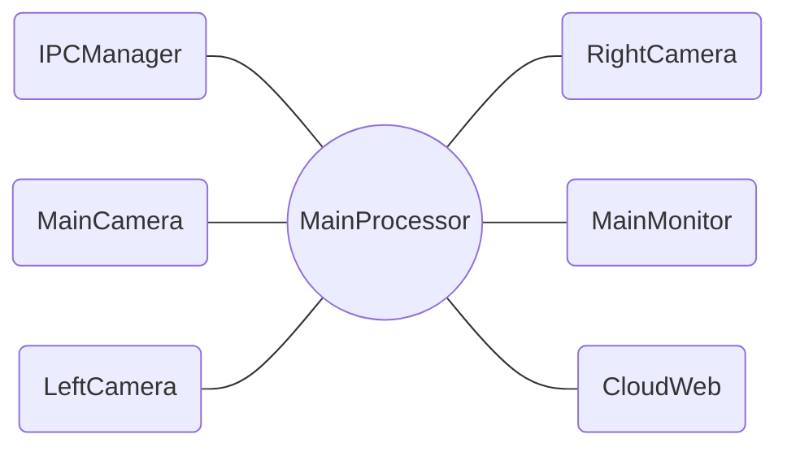
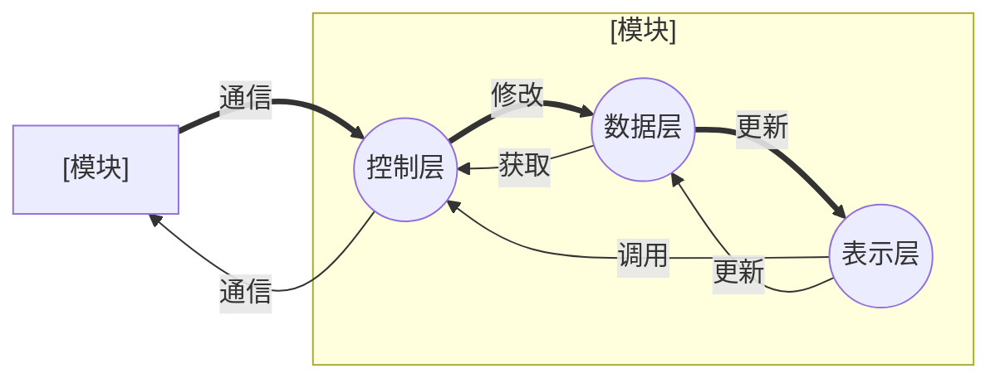
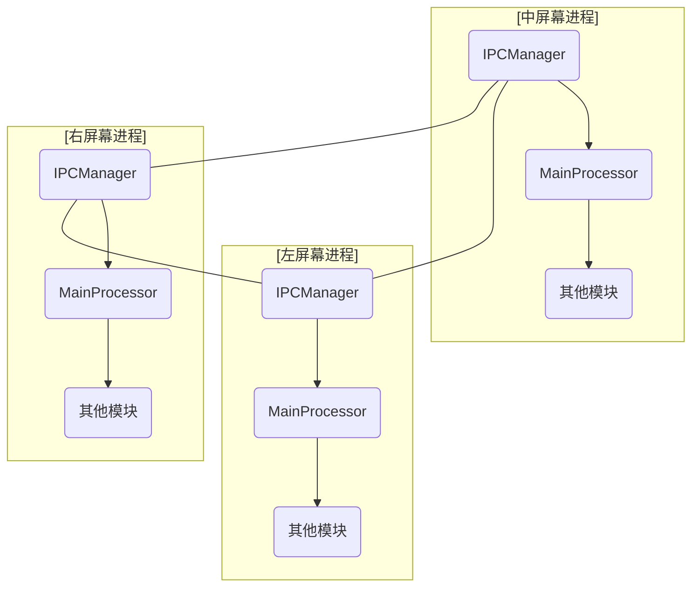

# RCD-UI

### 环境搭建

```bash
sudo apt install libsdl2-dev 
sudo apt install ffmpeg
sudo apt install libavcodec-dev libavdevice-dev 
sudo apt install libavfilter-dev libavformat-dev libavutil-dev libpostproc-dev libswresample-dev libswscale-dev
sudo apt install libzmq3-dev

git clone https://github.com/zeromq/cppzmq.git
mkdir cppzmq/build && cd cppzmq/build
cmake -DCPPZMQ_BUILD_TESTS=OFF ../ 
sudo make install
```

### 编译方式

```bash

cd RCD
    
#x86平台 ：
qmake -o Makefile RCD.pro
    
make -j$(nproc)
```

### 运行方式
   
```bash
#单进程3界面：
./RCD

#启动3进程 1界面对应1进程
./RCD -M

#单启左右界面
./RCD -L
./RCD -R

```
-----

### 项目介绍：

项目原设计为单进程创建3个屏幕界面方案，但是有两个瓶颈导致不能采用这种设计方案，所以改为3个屏幕3个进程方案。

**瓶颈：**
- 1，QT有这样一个特性，只能由主线程进行GUI渲染。所以绘制3个屏幕GUI时会出现单核吃满，还卡的情况。
- 2，RTX2060显卡驱动在Ubuntu上有BUG，导致单进程多窗口时，GPU渲染视频卡顿。且CPU、GPU负载都很低，似乎出现了互相锁定情况，使用A卡和笔记本N卡都不会出现。

#### 1. 名词解释

| 名词   | 解释 |
|-------|-----|
| 模块 (Module) | 实现一类功能的代码集合，模块之间独立解耦，原则上不允许直接相互调用或访问，信息交互可通过通讯接口。|
| 数据层 (Model) | 组层模块的三层之一，将模块中的数据抽象成model类。(非必须)|
| 控制层 (Control) | 组层模块的三层之一，将模块中的逻辑控制，状态管理抽象成类。(必须)|
| 表示层 (Widget) | 组层模块的三层之一，将模块中显示的动画图表相关抽象成类，目前继承QWidget类，有需要可使用qml替换。(非必须)|

#### 2. 目录结构

| 文件名| 说明 |
|-------|-----|
| config | 进程配置文件 |
| include | 需调用的其他项目头文件 |
| tools | 调测工具文件 |
| src/Component | 自写功能组件类，模块可直接实例化调用 |
| src/FunModule | 功能模块 |
| src/Interface | 多态基类 |
| src/MainFile | 主文件 |
| src/Protocol | 协议实现 |
| src/QsLog | 日志实现 |
| src/qss | 样式文件 |
| src/resource | 素材资源文件 |
| src/Widget | 带UI的功能模块 |
| System.h/.cpp | 系统类 |

#### 2. 架构图


##### 2.1 软件架构

```c++
// 当前全部模块
enum ModuleType
{
    MD_MainProcessor=0,       //核心处理模块
    MD_IPCManager,            //进程通信管理模块
    MD_InteractiveManager,    //输入交互管理模块

    MD_LeftCamera,            //左摄像头界面
    MD_DriveCamera,           //驾驶室摄像头界面
    MD_CloudWeb,              //web界面

    MD_MainCamera,            //主摄像头界面
    MD_MainMonitor,           //主监控界面

    MD_RightCamera,           //右摄像头界面
    MD_VehicleInfo,           //车辆信息界面
    MD_AllInfo,               //所有信息界面
    MD_WarnInfo,              //警告信息界面

    MD_Max
};
```

结构：



- 说明：软件结构呈现星型，通讯汇总于MainProcessor，它充当中间件并实现一些系统处理，线表示信号/槽通讯。

##### 2.2 模块内架构



##### 2.3 进程间架构

- 进层间通过ZMQ通信。




